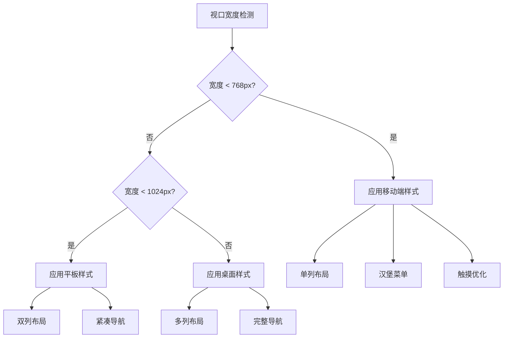

# Design Document: Mobile Responsive Adaptation

## Overview

本设计文档描述了环球旅记（Global Travel Blog）项目的移动端响应式适配方案。该项目基于 Flask + Tailwind CSS + Bootstrap 构建，需要通过 CSS 媒体查询和响应式设计模式来实现全面的移动端适配。

### 设计目标

1. **移动优先体验** - 确保在移动设备上提供流畅、直观的用户体验
2. **触摸友好** - 所有可交互元素满足最小 44x44px 的触摸目标要求
3. **性能优化** - 减少移动端不必要的动画和资源加载
4. **一致性** - 保持桌面端和移动端的视觉一致性

### 响应式断点

| 断点名称 | 宽度范围 | 目标设备 |
|---------|---------|---------|
| xs | < 480px | 小屏手机 |
| sm | 480px - 767px | 大屏手机 |
| md | 768px - 1023px | 平板设备 |
| lg | 1024px - 1279px | 小屏桌面 |
| xl | ≥ 1280px | 大屏桌面 |

## Architecture

### 技术栈

- **CSS 框架**: Tailwind CSS (已集成) + Bootstrap 5
- **响应式方案**: CSS 媒体查询 + Tailwind 响应式类
- **JavaScript**: 原生 JS 处理移动端交互

### 文件结构

```
static/
├── css/
│   ├── style.css          # 主样式文件（添加移动端样式）
│   └── mobile.css         # 移动端专用样式（新增）
├── js/
│   ├── main.js            # 主脚本（添加移动端交互）
│   └── mobile.js          # 移动端专用脚本（新增）
templates/
├── base.html              # 基础模板（更新响应式结构）
├── main/                  # 主要页面模板（更新）
├── auth/                  # 认证页面模板（更新）
└── admin/                 # 管理后台模板（更新）
```

### 响应式设计模式



## Components and Interfaces

### 1. 响应式导航组件

```css
/* 移动端导航样式 */
@media (max-width: 767px) {
    .desktop-nav { display: none; }
    .mobile-menu-btn { display: flex; }
    .mobile-nav-panel {
        position: fixed;
        right: -100%;
        transition: right 0.3s ease;
    }
    .mobile-nav-panel.open { right: 0; }
}
```

**接口定义**:
- `toggleMobileMenu()`: 切换移动端菜单显示状态
- `closeMobileMenu()`: 关闭移动端菜单
- `preventBodyScroll(boolean)`: 控制背景滚动

### 2. 响应式轮播组件

```css
@media (max-width: 767px) {
    .carousel { height: 70vh; }
    .carousel-caption h2 { font-size: 2rem; }
    .carousel-caption p { font-size: 1rem; }
    .carousel-buttons { flex-direction: column; }
    .carousel-buttons .btn { width: 100%; }
    .scroll-arrow { display: none; }
}
```

### 3. 响应式卡片网格

```css
/* 目的地卡片网格 */
.destination-grid {
    display: grid;
    gap: 16px;
}

@media (max-width: 479px) {
    .destination-grid { grid-template-columns: 1fr; }
}

@media (min-width: 480px) and (max-width: 767px) {
    .destination-grid { grid-template-columns: 1fr; }
}

@media (min-width: 768px) and (max-width: 1023px) {
    .destination-grid { grid-template-columns: repeat(2, 1fr); }
}

@media (min-width: 1024px) {
    .destination-grid { grid-template-columns: repeat(3, 1fr); }
}
```

### 4. 响应式表单组件

```css
@media (max-width: 767px) {
    .form-input {
        width: 100%;
        min-height: 44px;
        padding: 12px 16px;
    }
    .form-button {
        width: 100%;
        min-height: 44px;
    }
}
```

### 5. 响应式页脚组件

```css
@media (max-width: 767px) {
    .footer-grid {
        grid-template-columns: 1fr;
        text-align: center;
    }
    .footer-links { gap: 12px; }
    .newsletter-form {
        flex-direction: column;
    }
    .newsletter-form input,
    .newsletter-form button {
        width: 100%;
    }
}
```

## Data Models

本功能主要涉及前端样式和交互，不涉及数据模型变更。

### 配置数据

```javascript
// 响应式配置
const responsiveConfig = {
    breakpoints: {
        xs: 480,
        sm: 768,
        md: 1024,
        lg: 1280
    },
    touchTargetSize: 44,
    transitionDuration: 300,
    scrollThreshold: 50
};
```

## Correctness Properties

*A property is a characteristic or behavior that should hold true across all valid executions of a system-essentially, a formal statement about what the system should do. Properties serve as the bridge between human-readable specifications and machine-verifiable correctness guarantees.*

### Property 1: Touch Target Minimum Size
*For any* clickable or tappable element in the mobile view (viewport < 768px), the element's computed width and height SHALL both be at least 44 pixels.
**Validates: Requirements 1.5, 2.4, 5.2, 8.3, 11.3**

### Property 2: Responsive Grid Layout
*For any* grid container displaying cards (destinations, posts, tips), the number of columns SHALL match the expected count for the current viewport width:
- viewport < 480px: 1 column (tips: 1 column)
- viewport 480-767px: 1 column (tips: 2 columns)
- viewport 768-1023px: 2 columns
- viewport ≥ 1024px: 3+ columns
**Validates: Requirements 3.1, 3.3, 8.2, 9.2, 10.1, 10.2**

### Property 3: Full Width Elements on Mobile
*For any* form input, submit button, or action button on mobile devices (viewport < 768px), the element's computed width SHALL equal its container's content width (100%).
**Validates: Requirements 5.1, 5.4, 9.3, 11.4**

### Property 4: Responsive Typography
*For any* text element on mobile devices (viewport < 768px):
- Body text font-size SHALL be at least 14px
- Line-height SHALL be at least 1.6
- Carousel headings SHALL be 2rem
- Post titles SHALL be 1.5rem
**Validates: Requirements 2.2, 4.4, 6.1, 6.3, 6.4**

### Property 5: Navigation State Consistency
*For any* viewport width, exactly one navigation mode SHALL be active:
- viewport < 768px: hamburger menu visible, desktop nav hidden
- viewport ≥ 768px: desktop nav visible, hamburger menu hidden
**Validates: Requirements 1.1, 1.2**

### Property 6: Mobile Carousel Dimensions
*For any* carousel element on mobile devices (viewport < 768px), the carousel height SHALL be 70vh and control buttons SHALL have minimum dimensions of 44x44 pixels.
**Validates: Requirements 2.1, 2.4**

### Property 7: Card Image Height Consistency
*For any* destination card image on mobile devices (viewport < 768px), the computed height SHALL be 200px. For featured story images, the height SHALL be 300px.
**Validates: Requirements 3.2, 4.2**

### Property 8: Footer Layout on Mobile
*For any* footer section on mobile devices (viewport < 768px), columns SHALL be stacked vertically (flex-direction: column or single-column grid), content SHALL be center-aligned, and link spacing SHALL be at least 12px.
**Validates: Requirements 7.1, 7.2, 7.3**

### Property 9: Transition Duration Limit
*For any* CSS transition on mobile devices, the transition-duration SHALL be 300ms or less.
**Validates: Requirements 12.1**

### Property 10: Table Horizontal Scroll
*For any* data table in the admin section on mobile devices (viewport < 768px), the table container SHALL have overflow-x set to 'auto' or 'scroll' to enable horizontal scrolling.
**Validates: Requirements 11.2**

## Error Handling

### 降级策略

1. **CSS 不支持时**: 使用 `@supports` 查询提供降级样式
2. **JavaScript 禁用时**: 确保基本导航功能可用
3. **触摸事件不支持时**: 回退到点击事件

```css
/* 降级示例 */
@supports not (backdrop-filter: blur(8px)) {
    .mobile-nav-panel {
        background-color: rgba(255, 255, 255, 0.95);
    }
}
```

### 边界情况处理

1. **横屏模式**: 检测 orientation 变化并调整布局
2. **缩放**: 使用相对单位确保缩放后布局正常
3. **键盘弹出**: 处理虚拟键盘弹出时的视口变化

## Testing Strategy

### 单元测试

使用 Jest 测试 JavaScript 交互逻辑：

```javascript
describe('Mobile Navigation', () => {
    test('toggleMobileMenu should toggle menu visibility', () => {
        // 测试菜单切换逻辑
    });
    
    test('closeMobileMenu should close menu', () => {
        // 测试菜单关闭逻辑
    });
});
```

### 属性测试

使用 fast-check 进行属性测试，验证响应式行为的正确性：

```javascript
import fc from 'fast-check';

// Property 1: Touch Target Minimum Size
// **Feature: mobile-responsive, Property 1: Touch Target Minimum Size**
describe('Touch Target Size Property', () => {
    test('all touch targets should be at least 44x44px', () => {
        fc.assert(
            fc.property(
                fc.integer({ min: 320, max: 767 }), // mobile viewport widths
                (viewportWidth) => {
                    setViewportWidth(viewportWidth);
                    const touchTargets = document.querySelectorAll('button, a, [role="button"]');
                    return Array.from(touchTargets).every(el => {
                        const rect = el.getBoundingClientRect();
                        return rect.width >= 44 && rect.height >= 44;
                    });
                }
            ),
            { numRuns: 100 }
        );
    });
});
```

### 视觉回归测试

使用 Playwright 进行跨设备视觉测试：

```javascript
test('homepage mobile layout', async ({ page }) => {
    await page.setViewportSize({ width: 375, height: 667 });
    await page.goto('/');
    await expect(page).toHaveScreenshot('homepage-mobile.png');
});
```

### 测试设备矩阵

| 设备类型 | 分辨率 | 测试重点 |
|---------|--------|---------|
| iPhone SE | 375x667 | 小屏手机布局 |
| iPhone 14 | 390x844 | 标准手机布局 |
| iPad Mini | 768x1024 | 平板布局 |
| iPad Pro | 1024x1366 | 大平板布局 |

### 属性测试框架

- **框架选择**: fast-check (JavaScript 属性测试库)
- **最小迭代次数**: 100 次
- **测试标注格式**: `**Feature: mobile-responsive, Property {number}: {property_text}**`
